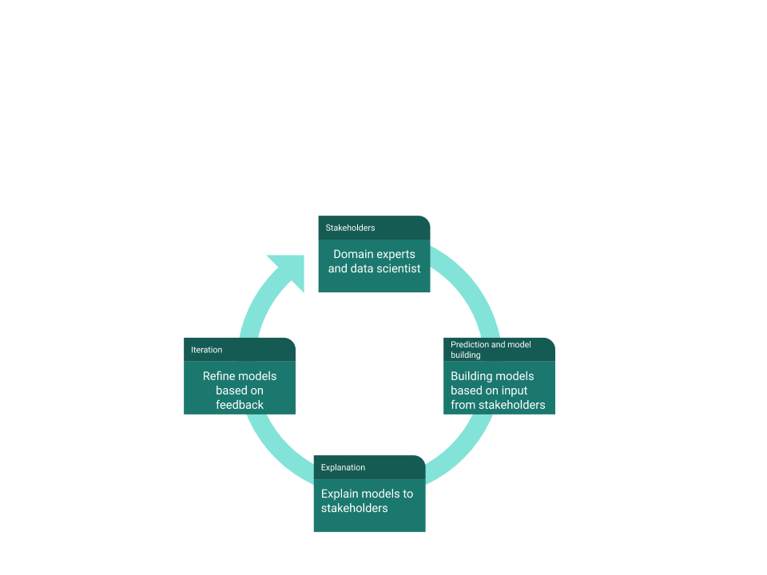

### Hello! 👋

My name is Soumya Banerjee (first name pronounced as show-mo) and I am a senior research fellow at the University of Cambridge.

I analyze complex problems and implement new statistical and machine learning techniques for deriving insights from large amounts of data.

I work at the intersection of complex systems and explainable Artificial Intelligence.

I have worked in the experimental sciences, clinical, financial and healthcare domains. I have also worked in industry and was domain certified in finance and mortgage.

- 🔭 I analyze complex problems and implement new statistical and machine learning techniques for deriving insights from large amounts of data

- 🌱 I work on data science, machine learning, computational biology, bioinformatics, computational immunology, computational immunogenomics and clinical informatics

- 📫 How to reach me and get more information on my work

     https://sites.google.com/site/neelsoumya
     
- ⚡  Publications

     https://sites.google.com/site/neelsoumya/publications
     
     A video about my research
     
     https://www.youtube.com/watch?v=vLl4nu6Dmgk
     
- 🌱 Software

     https://sites.google.com/site/neelsoumya/software

     - 💬 R packages I have written
          - https://github.com/neelsoumya/dsSurvival
          - https://github.com/neelsoumya/dsSurvivalClient
          - https://neelsoumya.github.io/dsSurvivalbookdown/

- ⚡ Outreach

     https://github.com/neelsoumya/outreach_ppi
     
     https://github.com/neelsoumya/ai_outreach
     
     https://github.com/neelsoumya/deep_dali
     
     https://github.com/neelsoumya/ramanujan_number_generator

- 💬 Teaching resources

     https://sites.google.com/site/neelsoumya/teaching
     
     https://github.com/neelsoumya/butterfly_detector
     
     https://github.com/neelsoumya/basic_statistics
     
     https://github.com/neelsoumya/teaching_resources
     
     https://github.com/neelsoumya/getting-_started_data_science
     
     https://github.com/neelsoumya/bioinformatics_resources
     
     https://github.com/neelsoumya/intro-machine-learning
     
     Teaching demo videos 
     
     https://www.youtube.com/watch?v=omxbpel-b64&feature=youtu.be
     
     https://www.youtube.com/watch?v=4_la9-Ehvmo
     
     Collected teaching resources
     
     https://osf.io/25gnz/
     
- 💬 Talks I have given

     https://www.youtube.com/watch?v=jDIt60LVyWY&list=PL_3n--M9GNtBevpfzHkelrRj03wVjAU0Q
     
     https://www.youtube.com/watch?v=omxbpel-b64&feature=youtu.be
     
     https://www.youtube.com/watch?v=4_la9-Ehvmo
     

- 😄 My software and data science portfolio can be found here
     
     https://github.com/neelsoumya/public_open_source_data_science

- 👯 I work very closely with domain experts and stakeholders and use computational tools for social good. I outline my design and work philosophy below.     

     * 

     
- ✨ Preprints of my papers

     https://github.com/neelsoumya/paper_preprints
     
     https://bitbucket.org/neelsoumya/paper_preprints
     
     
## Packages

R packages I have written

 https://github.com/neelsoumya/dsSurvival
 
 https://github.com/neelsoumya/dsSurvivalClient
 
 https://neelsoumya.github.io/dsSurvivalbookdown/

Other minor packages I have modified/contributed to from other resources/open source repositories (credit goes to the original authors)

 https://github.com/neelsoumya/dsMiscellaneous
 
 https://github.com/neelsoumya/rlib

 https://github.com/neelsoumya/dsSyntheticClient
 
 https://github.com/neelsoumya/dsSynthetic-1

 https://github.com/neelsoumya/meditator

 https://github.com/neelsoumya/ShinyDataSHIELD

## Software

https://sites.google.com/site/neelsoumya/software

https://resume.github.io/?neelsoumya

## Graphical user interfaces

https://sb2333medschl.shinyapps.io/meditator/

https://sb2333medschl.shinyapps.io/cosmic_loneliness/

https://neelsoumya.shinyapps.io/accident_prediction/

## Miscellaneous

Website

https://sites.google.com/site/neelsoumya

Patreon

https://www.patreon.com/soumyabanerjee

<a href="https://www.patreon.com/bePatron?u=75312474" data-patreon-widget-type="become-patron-button">Become a Patron!</a>

Youtube channel

https://www.youtube.com/channel/UCaEa-gedhvk0AUjEUjcNsmw
     

The stats above were generated using

https://github.com/anuraghazra/github-readme-stats

<!--
**neelsoumya/neelsoumya** is a ✨ _special_ ✨ repository because its `README.md` (this file) appears on your GitHub profile.

My name is Soumya Banerjee (first name pronounced as show-mo) and I am a researcher.

I analyze complex problems and implement new statistical and machine learning techniques for deriving insights from large amounts of data.

I have worked in financial and healthcare domains and am domain certified in finance and mortgage.

Here are some ideas to get you started:

- 🔭 I’m currently working on analyzing complex problems and implementing new statistical and machine learning techniques for deriving insights from large amounts of data
- 🌱 I’m currently learning ...
- 👯 I’m looking to collaborate on ...
- 🤔 I’m looking for help with ...
- 💬 Ask me about ...
- ⚡ Fun fact: ...
-->
